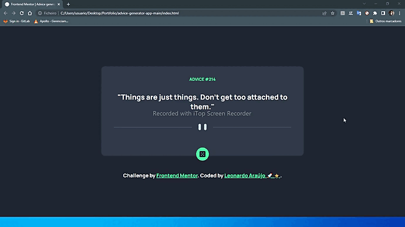

# Frontend Mentor - Advice generator app solution

This is a solution to the [Advice generator app challenge on Frontend Mentor](https://www.frontendmentor.io/challenges/advice-generator-app-QdUG-13db). Frontend Mentor challenges help you improve your coding skills by building realistic projects.

## Table of contents

- [Overview](#overview)
  - [The challenge](#the-challenge)
  - [Screenshot](#screenshot)
  - [Links](#links)
- [My process](#my-process)
  - [Built with](#built-with)
  - [What I learned](#what-i-learned)
  - [Continued development](#continued-development)
  - [Useful resources](#useful-resources)
- [Author](#author)

## Overview


### The challenge

Users should be able to:

- See an advice when opening the page.

- Request new advice after clicking the button.

### Screenshot



### Links

- Live Site URL: [Advice Generator](https://araujoleonardo310.github.io/advice-generator-app-main/)

## My process

### Built with

- Semantic HTML5 markup
- CSS custom properties
- Flexbox
- Mobile-first workflow

### What I learned

Make requests using fech

```js
fetch(`https://api.adviceslip.com/advice`, { method: "GET" })
  .then((response) => response.json())
  .then((data) => {
    createElementTitle.innerHTML += `${data.slip.id}`;
    createElementParagraph.innerHTML += `${data.slip.advice}"`;
  });
```

Create new elements and add attributes

```js
const createElementTitle = document.createElement("p");
const createElementParagraph = document.createElement("p");
main.insertBefore(createElementTitle, divider);
main.insertBefore(createElementParagraph, divider);
createElementTitle.classList.add("title");
createElementParagraph.classList.add("content");
```

Remove elements

```js
const contentTitle = document.getElementsByClassName("title")[0];
const contentParagraph = document.getElementsByClassName("content")[0];
main.removeChild(contentTitle);
main.removeChild(contentParagraph);
```
### Continued development

- Manipulate DOM elements with JavaScript

  - Creating new elements
  - Checking existing elements
  - Removing elements
  - Adding assignments

- Make website responsive to different screens
- Make requests and extract data from an API

### Useful resources

- [Media queries](https://developer.mozilla.org/pt-BR/docs/Web/CSS/Media_Queries/Using_media_queries) - This MDN documentation helped me remember and understand the syntax of Media queries.

- [Curso JavaScript #40 - Inserindo elementos (appendChild e insertBefore](https://youtu.be/0XJyTa6B-GA) - This tutorial provided a great understanding of how can I manipulate DOM elements with JS.

- [Conhecendo os elementos semânticos do HTML5](https://medium.com/reprogramabr/semanticahtml5-5252b4937f0a) I really liked this article, it answered questions about which tags to use and where to insert.

## Author

- LinkedIn - [Leonardo Araújo](https://www.linkedin.com/in/araujoleonardo310/)
- Frontend Mentor - [@araujoleonardo310](https://www.frontendmentor.io/profile/araujoleonardo310)
- GitHub - [araujoleonardo310](https://github.com/araujoleonardo310)
